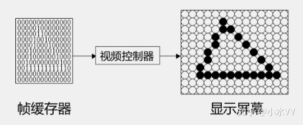
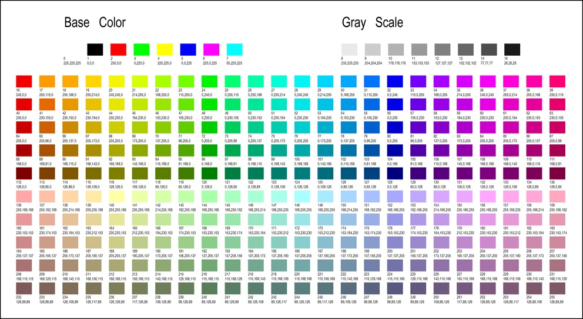
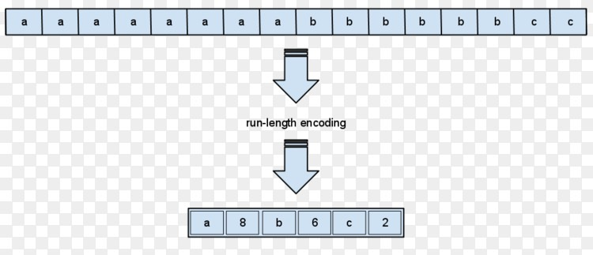

# 帧缓冲

帧缓冲器也称为帧缓冲或者显存，是用来存储渲染数据的地方。帧缓冲的每一个存储单位对应一个像素，它是屏幕显示画面的直接映象，又称为位映射图(Bit Map)。

# 调色板

传统的帧缓冲器支持的色彩模式很广泛。受限于昂贵的内存，大多数早期的帧缓冲器使用的是1位、2位、4位或 8位的色深。小的色深导致不能产生完整的色彩范围。其解决方法是为帧缓冲器增加一个查找表（lookup table，LUT），把帧缓冲器中存储的每个“颜色”作为一个索引。这就是所谓的索引色（indexed color）模式。

# 游程编码

游程编码（run-length encoding，RLE）是一种比较简单的压缩算法，其基本思想是将重复且连续出现多次的字符使用（连续出现次数，某个字符）来描述。

举例来说，字符串"AAAABBBCCDEEEE"，由4个A、3个B、2个C、1个D、4个E组成，游程编码将其压缩为4A3B2C1D4E，由14个字符转成10个字符，压缩比 71.4%。

游程编码的优点是将重复性高的数据压缩成小单位；若数据出现频率不高，压缩结果可能比原始数据大。例如："ABCDE"，压缩结果为"1A1B1C1D1E"，由5个字符转成10个字符，压缩比 200%。

