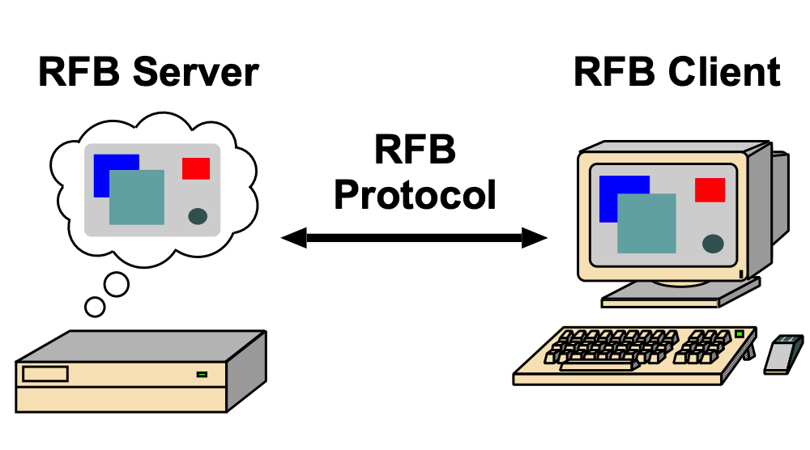

# 远程帧缓冲协议

该文档原著为：https://github.com/vincenthcui/rfc6143

## RFB 协议

RFB (Remote Framebuffer Protocol) 远程帧缓冲协议，是一种允许用户通过网络连接控制远端计算机的七层网络协议。
在 RFB 协议中，用户通过本地鼠标、键盘输入，经由远端计算机计算后，将图形用户界面（GUI）回传本地进行输出。

### 协议特点

协议设计有以下几个特点：

- 瘦客户端。客户端职责简单清晰，无状态
- 运行在弱网络环境下
- 跨操作系统兼容性

## 协议版本

RFB 协议有三个公开版本，分别是 3.3、3.7和3.8，3.8 是稳定版本。

|         版本          |    发布时间    |   协议差异    |
|:-------------------:|:----------:|:---------:|
|     Version 3.3     |  1998-01   |  服务器单向认证  |
|     Version 3.7     | 2003-8-12  | 关闭连接时返回原因 |
| Version 3.8 (Final) | 2010-11-26 |     -     |

三个版本只在协议的握手阶段和初始化阶段存在差异，在数据流交换阶段保持一致。

### 协议的拓展

第三方 VNC 服务端和客户端拓展了 3.8 版本协议，提供更多的认证方式，优化传输效率。

- Tight
- RealVNC
- Ultra
- VMWare

## RFB 的发展历史

- 2002 年，AT&T 关闭其位于英国剑桥的 Olivetti 研究实验室。
- 2002 年，VNC 技术发明者 Tristan Richardson 合伙成立 RealVNC 公司，向商业公司提供企业级远程访问软件。
- 2003年8月12日，Richardson 公开 RFB 协议的 3.7 版本。
- 2010年11月26日，发布稳定协议版本 v3.8。

> RFB 是 IETF 公开的开源通信协议
>
> RFB® 和 VNC® 是 RealVNC 公司的注册商标。

## 公开协议版本及资料

- [RFC 6143: The Remote Framebuffer Protocol (describes Version 3.8)](https://tools.ietf.org/html/rfc6143)
- [The RFB Protocol - Community Version](https://github.com/rfbproto/rfbproto/blob/master/rfbproto.rst)
- [The RFB Protocol - Version 3.8 (2010-11-26)](https://web.archive.org/web/20160410055332/http://www.realvnc.com/docs/rfbproto.pdf)
- [The RFB Protocol - Version 3.7 (2003-08-12)](https://web.archive.org/web/20040325204925/http://www.realvnc.com/docs/rfbproto.pdf)
