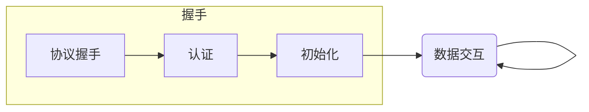

# 握手

RFB 协议有四个阶段：

- [协议握手](/rfc6143/handshake/protocol-version.md)：对协议版本达成共识
- [认证](/rfc6143/handshake/security-type.md)：认证客户端身份
- [初始化](/rfc6143/handshake/initial.md)：交换像素格式等背景数据
- [数据交互](/rfc6143/transfer/README.md)：传输交互事件，更新图像帧
