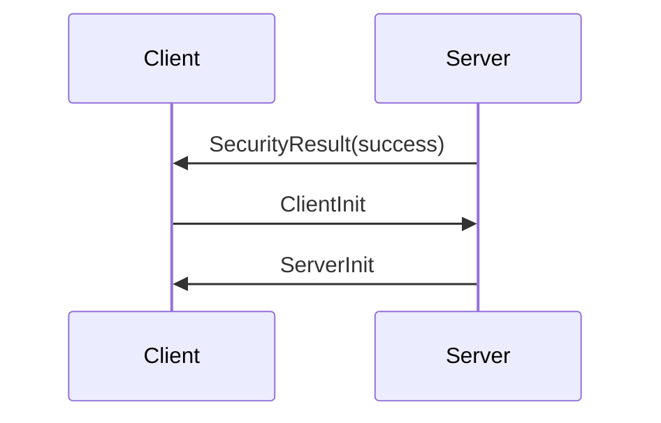

# 初始化

收 SecurityResult 后，客户端应当发送 [ClientInit](#客户端初始化) 数据包，收到后，服务端发送 [ServerInit](#服务端初始化) 包。



## 客户端初始化

客户端初始化需要声明是否的共享屏幕。

```
+--------------+--------------+-------------+
| No. of bytes | Type [Value] | Description |
+--------------+--------------+-------------+
| 1            | U8           | shared-flag |
+--------------+--------------+-------------+
```

- shared-flag: 是否与其他客户端共享连接。如果是 1，允许服务端保持/加入其他客户端的连接。如果是0，服务端应该主动断开与其他客户端的连接。

## 服务端初始化

收到 ClientInit 消息后，服务端发送 ServerInit 消息，声明帧缓冲区大小、像素格式以及桌面的名称。

```
  +--------------+--------------+------------------------------+
  | No. of bytes | Type [Value] | Description                  |
  +--------------+--------------+------------------------------+
  | 2            | U16          | framebuffer-width in pixels  |
  | 2            | U16          | framebuffer-height in pixels |
  | 16           | PIXEL_FORMAT | server-pixel-format          |
  | 4            | U32          | name-length                  |
  | name-length  | U8 array     | name-string                  |
  +--------------+--------------+------------------------------+
```

- framebuffer-width in pixels: 屏幕宽度
- framebuffer-height in pixels: 屏幕高度
- server-pixel-format: 服务器默认像素格式
- name-length/name-string: 桌面的名字

如果客户端无法响应服务端指定的 pixel-format，可以主动发起 [SetPixelFormat](/display/pixel-format.md#SetPixelFormat) 重新设置。
