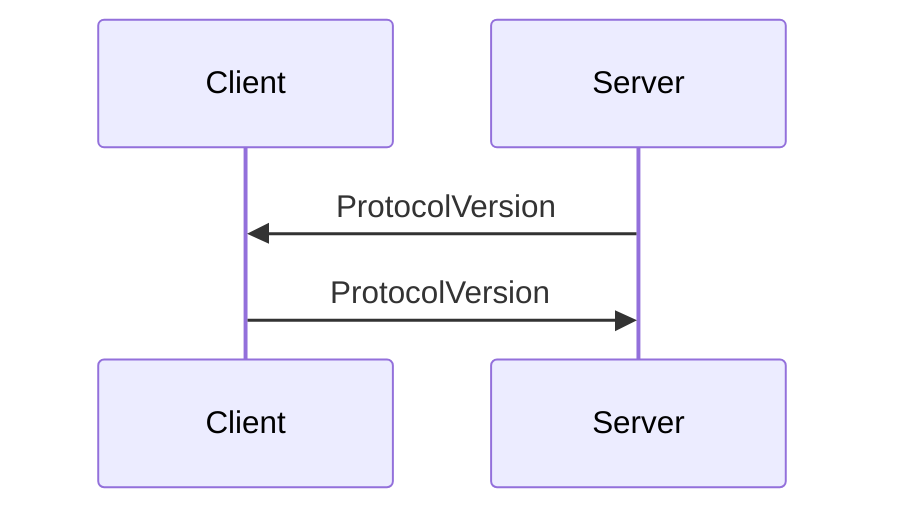

# 协议握手

协议握手对客户端和服务端通信过程使用的协议版本达成共识，有可能的情况下，对不同协议版本实现向前兼容。

## 握手过程

建立 TCP 连接后，服务器首先向客户端发送版本 X，收到 X 后，客户端向服务器发送不高于 X 的版本 Y。

RFB 有三个公开可选版本 3.3/3.7/3.8。

部分客户端或浏览器变种可能会发送其他的协议版本，统一将非标协议认定为 3.3（协议认为未公开协议版本没有实现3.7/3.8 中引入的特殊握手流程）。



## 协议报文

协议消息由标识符、主次版本组成，其结构体如下：

```
  +--------------+--------------+--------------+
  | No. of bytes | Type [Value] | Description  |
  +--------------+--------------+--------------+
  | 3            | U8 array     | protocol     |
  | 1            | U8 [32]      | blank        |
  | 3            | U8 array     | major version|
  | 1            | U8 [42]      | pot          |
  | 3            | U8 array     | minor version|
  +--------------+--------------+--------------+
```

对于 3.8 版本协议，其发送协议头部如下：

```
RFB 003.008\n (hex 52 46 42 20 30 30 33 2e 30 30 38 0a)
```
