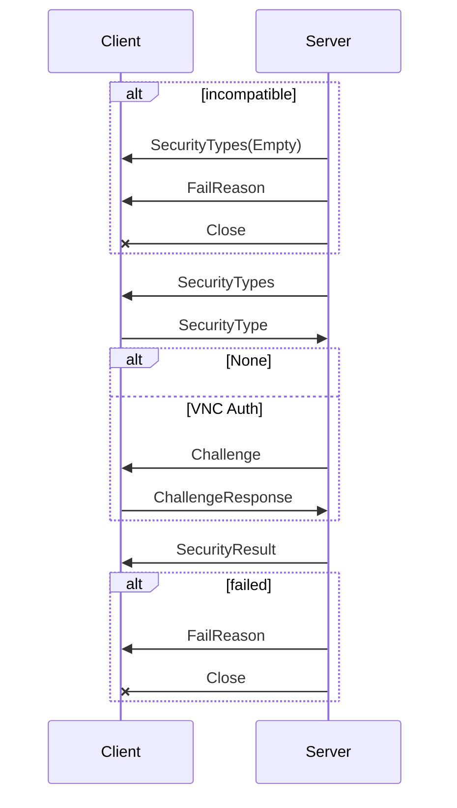

# 安全握手

协商好协议版本后，客户端和服务端进行安全握手，就认证方式达成共识，并完成认证过程。

## 握手过程

认证的流程图如下：



- 服务器向客户端列举支持的加密方式，客户端挑选支持的认证方式，告知服务端。
- 根据认证方式，完成认证
- 服务端返回认证结果，完成安全握手

## 协议报文

### security-types

```
   +--------------------------+-------------+--------------------------+
   | No. of bytes             | Type        | Description              |
   |                          | [Value]     |                          |
   +--------------------------+-------------+--------------------------+
   | 1                        | U8          | number-of-security-types |
   | number-of-security-types | U8 array    | security-types           |
   +--------------------------+-------------+--------------------------+
```

- number-of-security-types: 认证方式数量
- security-types: 认证方式标识符

协议定义的标识符有三种，剩下的由协议厂家进行拓展：

```
  +--------+--------------------+
  | Number | Name               |
  +--------+--------------------+
  | 0      | Invalid            |
  | 1      | None               |
  | 2      | VNC Authentication |
  +--------+--------------------+
```

### security-type

客户端以单字节报文告知选择的认证方式

```
  +--------------+--------------+---------------+
  | No. of bytes | Type [Value] | Description   |
  +--------------+--------------+---------------+
  | 1            | U8           | security-type |
  +--------------+--------------+---------------+
```

- security-type: 达成共识的协议标识符

### fail-reason

当错误发送时，例如，服务端不兼容客户端版本，服务端会发送空的 SecurityTypes，发送消息说明错误原因后，关闭连接。

FailReason 报文如下：

```
 +---------------+--------------+---------------+
 | No. of bytes  | Type [Value] | Description   |
 +---------------+--------------+---------------+
 | 4             | U32          | reason-length |
 | reason-length | U8 array     | reason-string |
 +---------------+--------------+---------------+
```

- reason-length: 原因长度
- reason-string: 错误原因

### VNC Auth

VNC Auth 过程，服务器首先发送 16 字节的随机字符串，作为 `challenge`。客户端用密码通过 `DES` 算法对 `challenge` 进行加密，将加密后的 16 字节结果告知服务端。

> TODO: 加密算法详解

有几点需要注意：

- 为格式化密钥，密码会被删节/补齐为 8 字符
- VNC Auth 是弱加密，不能用于不可信网络
- 为了更安全访问，可以通过 IPsec/SSH 加密链路

#### Challenge

```
+--------------+--------------+-------------+
| No. of bytes | Type [Value] | Description |
+--------------+--------------+-------------+
| 16           | U8           | challenge   |
+--------------+--------------+-------------+
```

#### ChallengeResponse

```
+--------------+--------------+-------------+
| No. of bytes | Type [Value] | Description |
+--------------+--------------+-------------+
| 16           | U8           | response    |
+--------------+--------------+-------------+
```

### SecurityResult

客户端选择认证方式后，服务端返回 SecurityResult 告知认证结果，哪怕使用 `None` 认证。

如果认证失败，服务器发送 `failed` 和 fail-reason 报文，主动关闭连接。

```
+--------------+--------------+-------------+
| No. of bytes | Type [Value] | Description |
+--------------+--------------+-------------+
| 4            | U32          | status:     |
|              | 0            | OK          |
|              | 1            | failed      |
+--------------+--------------+-------------+
```
