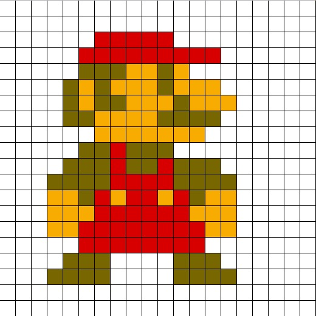

# 像素格式

[帧缓冲](/rfc6143/GLOSSORY.md#帧缓冲)由像素构成。



## PixelFormat

RFB 协议中，使用 16 字节结构体 PIXEL_FORMAT 描述像素的格式。

```
 +--------------+--------------+-----------------+
 | No. of bytes | Type [Value] | Description     |
 +--------------+--------------+-----------------+
 | 1            | U8           | bits-per-pixel  |
 | 1            | U8           | depth           |
 | 1            | U8           | big-endian-flag |
 | 1            | U8           | true-color-flag |
 | 2            | U16          | red-max         |
 | 2            | U16          | green-max       |
 | 2            | U16          | blue-max        |
 | 1            | U8           | red-shift       |
 | 1            | U8           | green-shift     |
 | 1            | U8           | blue-shift      |
 | 3            |              | padding         |
 +--------------+--------------+-----------------+
```

- bits-per-pixel: 像素的位数，位数越大，色彩越丰富。只支持[8|16|32]
- depth: 色深，像素中表示色彩的位数
- big-endian-flag: 多字节像素的字节序，非零即大端序
- true-color-flag: 1 表示真彩色，pixel 的值表示 RGB 颜色；0 表示调色板，pexel 的值表示颜色在调色板的偏移量
- -max/-shift: 获取红蓝绿三色的位移量和长度，max=2^N-1,N是颜色的位数

```
 BigEndian:    Blue Shift       Green Shift         Red Shift
                   │                 │                 │
                   ▼                 ▼                 ▼
┌──────────────────┬─────────────────┬─────────────────┐
│     BLUE MAX     │    GREEN MAX    │     RED MAX     │
└──────────────────┴─────────────────┴─────────────────┘
```

> bits-per-pixel 必须大于或等于 depth

## SetPixelFormat

客户端发送 SetPixelFormat，声明需要的的像素格式（画面质量）。此消息覆盖 [ServerInit](/rfc6143/handshake/initial.md#服务端初始化) 消息中服务端声明的初始化像素格式。

当 true-color-flag 为 0 时，服务端必须发送 SetColorMapEntries，声明使用的颜色表。客户端发送 SetPixelFormat 后，需清空本地缓存的颜色表，无论颜色表中是否有内容。

```
+--------------+--------------+--------------+
| No. of bytes | Type [Value] | Description  |
+--------------+--------------+--------------+
| 1            | U8 [0]       | message-type |
| 3            |              | padding      |
| 16           | PIXEL_FORMAT | pixel-format |
+--------------+--------------+--------------+
```

- message-type: 消息类型，固定为 0
- pixel-format: [PixelFormat](#pixelformat) 结构
